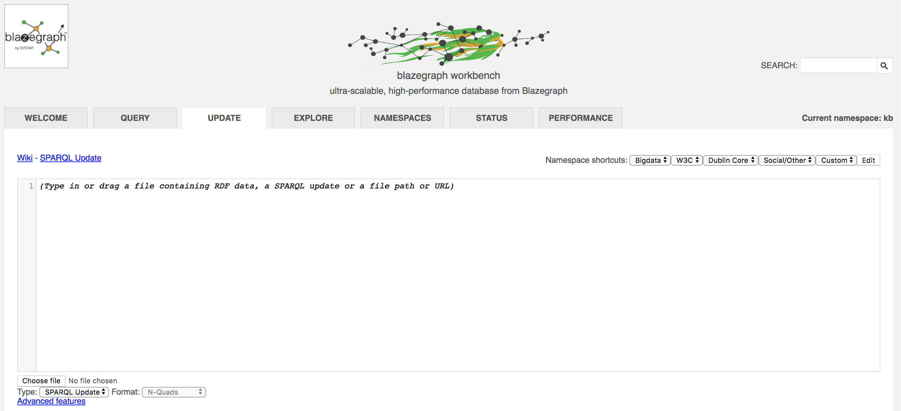

# Creative Passport

This project is the result of the Music Tech Fest Mycelia Lab that took place in Stockholm
at the KTH in September 4-7. The Lab was lead by Imogen Heap, who came up with the idea
of [Mycelia for music and the creative passport](http://myceliaformusic.org/creative-passport/).

This project is the start to an artist's dashboard with which an artist can manage
all the information that would be included in their creative passport. This project
is based on the [graph-application](https://github.com/katsi/graph-application) tutorial,
which is a simple web application that is talking to the graph database Blazegraph.


## Credits
This project gets its good looks from the
[Light Bootstrap Dashboard by Creative Tim](https://www.creative-tim.com/product/light-bootstrap-dashboard)
web template.

# Getting started

## Requirements

Make sure you have installed [Docker](https://docs.docker.com/install/)

Make sure you have [Node.js installed](https://nodejs.org/en/) and `npm` that should come with it. You can check this by running `node -v` and `npm -v` )

## Set up your local repository

Either download or `git clone` this repository to your local machine.

Open up a terminal and navigate to this repository.


***For Mac users***
If you downloaded this repository, most likely a ZIP file is in your
`Downloads` folder. Unzip the file and then navigate to
the folder, for example with:

```
cd Downloads/graph-application-master/
```


## Running a Graph Database

For the data of songs, albums, and events we are using
the [Blazegraph](https://wiki.blazegraph.com/wiki/index.php/About_Blazegraph) graph database.
In order for this project to run you will need to run an instance of blazegraph and upload the
data into it. Only then will the web app work.


### Run Blazegraph from a Docker image
The easiest way to run Blazegraph is to use a popular Docker image. You can find
those in Dockerhub. I suggest using [lyrasis/blazegraph](https://hub.docker.com/r/lyrasis/blazegraph/).

Make sure you have installed [Docker](https://docs.docker.com/install/)

Then run the following command to run Blazegraph according to the chosen docker image.
```
docker run --name blazegraph -d -p 8889:8080 lyrasis/blazegraph:2.1.4
```

To see the dashboard for Blazegraph, navigate with your browser to the [localhost port 8889](http://localhost:8889/bigdata/).

### Add Data to Blazegraph

Make sure you have Blazegraph running. You can see that it is running by typing

```
docker ps
```

Navigate to the dashboard of Blazegraph [localhost port 8889](http://localhost:8889/bigdata/)
and choose the tab "Update"



Below the big text edit field, you can spot a button saying "Choose file". This is where you can upload
the following RDF Data files:
- [Turtle file on events](data/events.ttl)
- [Turtle file on songs](data/songs.ttl)

found in the data folder of this tutorial.

Add the files one by one. The contents of each TTL file appears in the empty text box and by
clicking "Update" below the contents of one file is uploaded in the graph database. Repeat this
step for the second file.

## Setting up a The Creative Passport Dashboard Locally

The dashboard is build using a
simple [express JavaScript](https://expressjs.com/en/starter/installing.html) file and
several [Embedded JavaScript](http://ejs.co/) template files
to render the views of the dashboard with data coming out of the graph.

Navigate to the local folder of this project (it would be called `creative-passport-dashboard` or `creative-passport-dashboard-master`).

***Requirements:*** Make sure you have [Node.js installed](https://nodejs.org/en/) and
`npm` that should come with it. You can check this by running `node -v` and `npm -v` )


Install all the dependencies of this project with:

```
npm install
```

Install express:

```
npm install express --save
```

We are using the Embedded JavaScript templates to render some views and pass some parameters to it.
Make sure you have [ejs installed](http://ejs.co/):

```
npm install ejs
```

Run the [index.js](index.js) file of this repo with:

```
node index.js
```

Navigate with your browser to [http://localhost:3001/pages/dashboard.html](http://localhost:3001/pages/dashboard.html)
and you should see the first page.